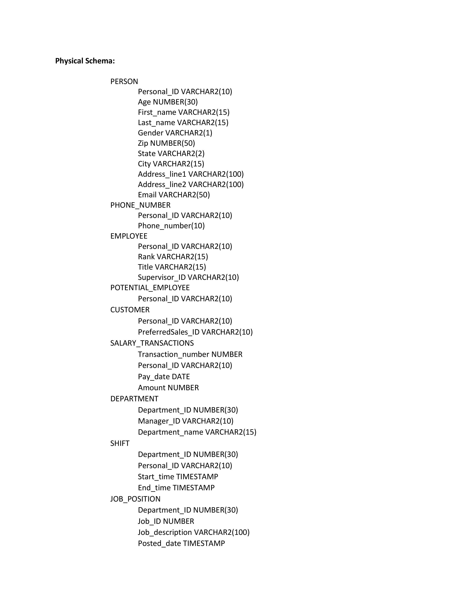

|**Semester Project** |**Database Design – Fall 2020**|
| :- | :- |
|
Due 12/01/2020

**Jonathan Schroeter**

**JAS170005**

|

“High Quality PNGs of Diagrams and Physical Schema” folder holds PNGs of Diagrams and the physical schema

“SQL Tables\_inserts\_queries” folder holds the SQL tables, insert, and query scripts, Also holds the dummy data list and a better view of SQL tables

|
There is an XYZ Company, which purchases some parts from vendors to produce some products. It has several departments, marketing sites, and parts supply vendors in the company.

**Problem Description**
**
`	`The problem for this project was to create a database for XYZ Company so they could store their own employee/department/site information, but to also store extended information that the company will use. It needs to store information about vendors who the company works with for part purchases, and customers that the company is selling their products to. The database needs to hold all this information, and the additional requirements given in the project requirements. 

**Requirements and Design Assumptions/Decisions:**

1) For each department, department id and department name will be recorded.

-Assumptions and Design Decisions: 

-Each department will have a manager, but only one manager.

-Department names are not unique, their might be two different “marketing” departments, but their ids will be different

-The department id is between 100 and 999

\2) People in the company can be divided into three types -- employees, customers, and potential employees. Each person can belong to more than one type. Each person in the company has the following attributes:  Personal\_ID, Name (Last Name, First Name), Age (below 65), Gender, Address (address line 1, address line 2, city, state, zipcode), and Phone number (one individual may have more than one phone number). For customers, his/her preferred salesmen were recorded in the system. For employees, Rank and Title (e.g. CEO, Principle, Partner, etc.) will be recorded for them.

-Assumptions and Design Decisions: 

-Everyone will be included in the person class, and the specialization/generalization will be used to have total overlapping where someone could be an employee, customer, and a potential employee, or vice versa. 

-Email is not unique. People can share emails (IE the customer support team has one email account) and each person will only have 1 each account for work

-Phone number is not unique either, but since people could have multiple phone numbers, it will be made into its own table

-Limit on the age of a person, to be in the database they must between 16 and 65

`	`-The customers preferred salesman must be an employee

\3) Each employee of the company must have only one direct supervisor, while each supervisor can have several supervisees. One employee can work for one or more departments at different time. But at one time, one employee can only work for one department. The system needs to record start time and end time for each shift among different department for one employee.

-Assumptions and Design Decisions: 

`	`-An employee does not have to have a supervisor, but if it does it can only have 1

-I took the requirement that says, “One employee can work for one or more departments at different time. But at one time, one employee can only work for one department.” As that an employee can have different shifts within the company, but each shift is within only one department. John Smith might work for marketing one day, but the next day he might work in the sales department. Therefore, an employee is not specifically assigned to a department, but only assigned during their shift.

`	`-Each department\_id will be between 100 and 999

\4) Each job position’s information is recorded to hire new people. It contains the Job ID, job description, and posted date in the system.

-Assumptions and Design Decisions: 

`		`-The job\_id will be a number between 1 and 9999999

-The posted\_date will be in timestamp format so more data can be gotten about exactly when the job was posted.

`		`-Each department will post these jobs

\5) The job positions are posted by the departments. Both existing employees and potential employees can apply each job post by any department. The company will select some candidates from the applications and make interviews.

`	`-Assumptions and Design Decisions: 

-Anyone in the person table can apply for the positions since the positions are open to everyone.

-After they apply, all people will be in the potential employee table so they can be picked for interviews.

-For the company to make selections for interviews, they must be in the potential employee table. 

\6) For each job position, several interviews will be made to select a suitable person.

`	`-Assumptions and Design Decisions:

`		`-A potential employee can interview for multiple positions.

\7) For each interview, candidates (interviewees), interviewers, job position and interview time are recorded. After each round interview, the interviewers give a grade to it ranging from 0 to 100. The grade over 60 represents that the interviewee pass the interview. One person is selected when her/his average grade is over 70 and she/he passes at least 5 rounds of interviews.

-Assumptions and Design Decisions:

`	`-An employee must be the interview

`	`-Only one interview per round

`	`-There can be many different interviews for one job position.

-The primary keys are (Canidate\_id, Job\_ID, Round\_number) these are the only items needed to create a unique match

`	`-Interviews can be at the same time

\8) For each product in the company, the system needs to record Product ID, Product Type, Size, List Price, Weight, and Style.

`	`-Assumptions and Design Decisions:

`		`-The primary key will be the Product\_id

-Product names could be the same, but their id will be different. There could be two “wheels” but one wheel could have a different size and weight, therefore the name is not unique.

`		`- List\_price between 1 and 99999

`		`- Weight between 1 and 99999

`		`- Product\_Size between 1 and 99999

\9) There are many marketing sites for the company. For each site, Site ID, Site Name, and Site Location are recorded.

`	`-Assumptions and Design Decisions:

`		`-The primary key will be the Site\_ID

-The site\_name is not unique. There could be two different sites with the same name, therefore name is not unique.

`		`-A full address for the site is not put, only the city and state where it resides.

`		`-Site\_ID between 1 and 99999

\10) There are several people working for each site, and meanwhile, one person can work on different sites. It is able to track the details of each sale history --- salesmen, customers, product, sale time, and sites.

-Assumptions and Design Decisions:

`	`-One person can be a worker for different sites.

`	`-Each site can have an unlimited number of workers.

`	`-So, the unique match for Site\_workers would be Site\_ID, Personal\_ID

`	`-Employees can only work at the sites

\11) Part purchase is also a vital activity in the company. The system needs to record each vendor’s Vendor ID, Name, Address, Account Number, Credit Rating, and Purchasing Web Service URL.

`	`-Assumptions and Design Decisions:

`		`-When buying parts, the company will pick the cheapest price for each part.

`		`-Part\_id between 1 and 99999

`		`-Price between 1 and 99999

`		`-Account\_number between 1 and 99999

`		`-Credit\_rating between 1 and 99999

-Account number is not unique, two different vendors could share the same account number if they have the same parent company. 

-Also, the vendor name is not unique, could be two vendors with the same name.

`		`-Vendor\_ID is the only unique aspect of the vendors

\12) One vendor may supply many types of parts. The price of the same part type may vary from different vendors but the price of one part type of one vendor will keep same. It can track which part types used in each product and the number of each type of part used for the product.

`	`-Assumptions and Design Decisions:

-Many vendors can offer a different price for one part, but when the company decides to buy parts, they will buy from the vendor who is selling that part the cheapest.

`		`-To get the cost per product, it would be the Min(price)\*part\_amount

`		`-Price between 1 and 99999 (no part is free)

\13) In addition, the system maintains the information of each employee’s monthly salary which includes transaction number, pay\_date, and amount (Note: transaction number could be same among different employees. However, for each employee, the transaction number is unique).

**	-Assumptions and Design Decisions:

-PRIMARY KEYS are (Personal\_ID, Transaction\_number) since two different employees can have transaction 1 for themselves

`		`-Transaction\_number  between 1 and 999999

`		`- Amount between 1 and 999999999

**Project Questions**

· Can you think 5 more rules (other than the one explicitly described above) that are likely to be used in a company.

-Email is needed for each person (this only mentioned in the queries, therefore this should be a rule)

`	`-The company will use the cheapest costing parts for the products 

`	`-Only employees can be interviewers 

`	`-Employees must be 16 or over to work for the company (to meet Texas state law)

`	`-Phone numbers must be the correct form for US

· Is the ability to model super-class/subclass relationships likely to be important in such environment? Why or why not?

The ability to model super-class/subclass relationships is important because of the Person-Employee-Customers-Potential\_Employee tables. It can get rid of duplicate data and reduce space in the environment. We don’t have to store the names in addresses for each person inside Employee or customer, we can store all that stuff within Person and make Employee and Customer subclasses and have them relate to person. Therefore, this would make it very important to have. 

· Justify using a Relational DBMS like Oracle for this project.

A DBMS is a good system for storing data and having it relate to other data through aspects of a DBMS like foreign keys/constraints. It can store large amounts of data and allow for this data to be manipulated and retrieved via queries or the such.  Oracle allows us to easily take the written requirements and translate into DBMS tables, which can allow non-technical people to write requirements for technical projects.

**Project Exercises**

**I.** Draw an EER to accurately represent this set of requirements. This will be your Conceptual Design. Clearly specify any assumption that you are making. You can use any tools (software) to draw the EER. You don’t need describe the value constraints of the attributions in the EER diagram. (25%)  

(See EER\_DIAGRAM.PNG for a better view of this diagram)	

Many of the more major assumptions were made up above, but here are the ones only explain EER choice

-Total overlapping between Person-Employee-Potential\_employee, and customer since it can be any or all of them.

-Supervision is a relation from employee to employee for a supervisor for employees

-Employees do not have to work at sites, some may be completely remote

-Someone may apply for a job, but it does not mean they have to get an interview

-Anyone can apply for a job, and once they do they immediately become a potential employee

**II.** Use a relational DBMS to implement the database. Perform the following steps. (20%) 

a) Convert your Conceptual model to a Logical model that can be implemented in a relational DBMS like Oracle. During this process you replace M-N relationships and multi-valued attributes with constructs that can be implemented in the relational DBMS. Draw EER for the logical model after your modifications Feel free to change your conceptual model (first delivery) if needed.

`	`

b) Convert the EER to a database design. Document your design in Database Schema format like the one we discussed in the class. 

III. Use appropriate naming conventions for all of your tables and attributes. (40%)

a) Normalize all of your tables to third normal form. Make any necessary changes to the EER. Explain why these changes needed to be made.

No changes were made. All tables were already in 3NF (shown in the 3NF diagram)

b) Draw a dependency diagram for each table

`	`Dependency diagram again

3NF Diagram

You can get all the other attributes in a tuple just by the primary key(s). There is no transitive or partial dependency, therefore all the tables are in 3NF.

c) Write SQL statements to create database, tables and all other structures. Primary keys and foreign keys must be defined appropriately. The quantity constraints of the relation between the entities, which should be described in EER diagram, are not required.

(The script is in CS 4347 - PROJ-TABLE-SCRIPT)

`	`CREATE TABLE PART(Part\_id NUMBER NOT NULL,

`			`Part\_name VARCHAR2(15) NOT NULL,

`            `Weight NUMBER NOT NULL,

`			`PRIMARY KEY(Part\_id));

CREATE TABLE PRODUCT(Product\_id VARCHAR2(10) NOT NULL,

`			`List\_price NUMBER NOT NULL,

`			`Product\_name VARCHAR2(15) NOT NULL,

`			`Weight NUMBER NOT NULL,

`			`Product\_Style VARCHAR2(15) NOT NULL,

`			`Product\_size NUMBER NOT NULL,

`			`Product\_type VARCHAR2(100) NOT NULL,

`			`PRIMARY KEY(Product\_id));

CREATE TABLE MARKETING\_SITE(Site\_name VARCHAR2(15) NOT NULL,

`			`Site\_ID NUMBER NOT NULL,

`			`Site\_location VARCHAR2(30) NOT NULL,

`            `Site\_state VARCHAR2(2) NOT NULL,

`			`PRIMARY KEY(Site\_ID));

CREATE TABLE VENDOR(Vendor\_id VARCHAR2(10) NOT NULL,

`			`Name VARCHAR2(15) NOT NULL,

`			`Address\_line1 VARCHAR2(100) NOT NULL,

`			`Address\_line2 VARCHAR2(100),

`			`Zip NUMBER(5,0) NOT NULL,

`			`State VARCHAR2(2) NOT NULL,

`			`City VARCHAR2(15) NOT NULL,

`			`Account\_number NUMBER NOT NULL,

`			`Credit\_rating NUMBER NOT NULL,

`			`PURCHASING\_WEB\_URL VARCHAR2(100) NOT NULL,

`			`PRIMARY KEY(Vendor\_id));

CREATE TABLE VENDOR\_SALES(Part\_id NUMBER NOT NULL,

`			`Price NUMBER NOT NULL,

`			`Vendor\_id VARCHAR2(10) NOT NULL,

`			`PRIMARY KEY(Part\_id,Vendor\_id),

`			`FOREIGN KEY(Part\_id) REFERENCES PART(Part\_id),

`			`FOREIGN KEY(Vendor\_id) REFERENCES VENDOR(Vendor\_id));

CREATE TABLE PRODUCT\_PARTS(Product\_id VARCHAR2(10) NOT NULL,

`			`Part\_id NUMBER NOT NULL,

`			`Part\_count NUMBER NOT NULL,

`			`PRIMARY KEY(Product\_id, Part\_id),

`			`FOREIGN KEY(Part\_id) REFERENCES PART(Part\_id),

`			`FOREIGN KEY(Product\_id) REFERENCES PRODUCT(Product\_id));

CREATE TABLE PERSON(Personal\_ID VARCHAR2(10) NOT NULL,

`			`Age NUMBER(3,0) NOT NULL,

`			`First\_name VARCHAR2(15) NOT NULL,

`			`Last\_name VARCHAR2(15) NOT NULL,

`			`Gender VARCHAR2(1) NOT NULL,

`			`Zip NUMBER NOT NULL,

`			`State VARCHAR2(2) NOT NULL,

`			`City VARCHAR2(15) NOT NULL,

`			`Address\_line1 VARCHAR2(100) NOT NULL,

`			`Address\_line2 VARCHAR2(15),

`			`Email VARCHAR2(50) NOT NULL,

`			`PRIMARY KEY(Personal\_ID));

CREATE TABLE POTENTIAL\_EMPLOYEE(Personal\_ID VARCHAR2(10) NOT NULL,

`			`PRIMARY KEY(Personal\_ID),

`            `FOREIGN KEY(Personal\_ID) REFERENCES PERSON(Personal\_ID));

CREATE TABLE EMPLOYEE(Personal\_ID VARCHAR2(10) NOT NULL,

`			`Rank VARCHAR2(15) NOT NULL,

`            `Title VARCHAR2(15) NOT NULL,

`			`Supervisor\_ID VARCHAR2(10),

`			`PRIMARY KEY(Personal\_ID),

`			`FOREIGN KEY(Personal\_ID) REFERENCES PERSON(Personal\_ID));

CREATE TABLE DEPARTMENT(Department\_ID NUMBER(3,0) NOT NULL,

`			`Manager\_ID VARCHAR2(10) NOT NULL,

`			`Department\_name VARCHAR2(15) NOT NULL,

`			`PRIMARY KEY(Department\_ID));

alter table EMPLOYEE add FOREIGN KEY(Supervisor\_ID) REFERENCES EMPLOYEE(Personal\_ID);

alter table DEPARTMENT ADD FOREIGN KEY(Manager\_ID) REFERENCES EMPLOYEE(Personal\_ID);

CREATE TABLE CUSTOMER(Personal\_ID VARCHAR2(10) NOT NULL,

`			`PreferredSales\_ID VARCHAR2(10) NOT NULL,

`			`PRIMARY KEY(Personal\_ID),

`			`FOREIGN KEY(Personal\_ID) REFERENCES PERSON(Personal\_ID),

`			`FOREIGN KEY(PreferredSales\_ID) REFERENCES EMPLOYEE(Personal\_ID));

CREATE TABLE SALARY\_TRANSACTIONS(Transaction\_number NUMBER NOT NULL,

`			`Personal\_ID VARCHAR2(10) NOT NULL,

`			`Pay\_date TIMESTAMP NOT NULL,

`			`Amount NUMBER NOT NULL,

`			`PRIMARY KEY(Personal\_ID, Transaction\_number));

CREATE TABLE SHIFT(Department\_ID NUMBER(3,0) NOT NULL,

`			`Personal\_ID VARCHAR2(10) NOT NULL,

`			`Start\_time TIMESTAMP NOT NULL,

`			`End\_time TIMESTAMP NOT NULL,

`			`PRIMARY KEY(Department\_ID, Personal\_ID, Start\_time),

`            `FOREIGN KEY(Personal\_ID) REFERENCES EMPLOYEE(Personal\_ID),

`			`FOREIGN KEY(Department\_ID) REFERENCES DEPARTMENT (Department\_ID));

CREATE TABLE JOB\_POSITION(Department\_ID NUMBER(3,0) NOT NULL,

`			`Job\_ID NUMBER NOT NULL,

`			`Job\_description VARCHAR2(100) NOT NULL,

`			`Posted\_date TIMESTAMP NOT NULL,

`			`PRIMARY KEY(Job\_ID),

`			`FOREIGN KEY(Department\_ID) REFERENCES DEPARTMENT (Department\_ID));

CREATE TABLE APPLIES\_FOR(Personal\_ID VARCHAR2(10) NOT NULL,

`			`Job\_ID NUMBER NOT NULL,

`			`PRIMARY KEY(Personal\_ID, Job\_ID),

`			`FOREIGN KEY(Personal\_ID)REFERENCES PERSON(Personal\_ID),

`			`FOREIGN KEY(Job\_ID)REFERENCES JOB\_POSITION(Job\_ID));

CREATE TABLE SITE\_WORKERS(Personal\_ID VARCHAR2(10) NOT NULL,

`			`Site\_ID NUMBER NOT NULL,

`			`PRIMARY KEY(Site\_ID, Personal\_ID),

`			`FOREIGN KEY(Personal\_ID) REFERENCES EMPLOYEE(Personal\_ID),

`			`FOREIGN KEY(Site\_ID) REFERENCES MARKETING\_SITE(Site\_ID));

CREATE TABLE Interview(Interviewer\_ID VARCHAR2(10) NOT NULL,

`			`Canidate\_ID VARCHAR2(10) NOT NULL,

`			`Job\_ID NUMBER NOT NULL,

`			`Time TIMESTAMP NOT NULL,

`			`Round\_number NUMBER NOT NULL,

`			`Score NUMBER NOT NULL,

`			`PRIMARY KEY(Canidate\_id, Job\_ID, Round\_number),

`			`FOREIGN KEY(Interviewer\_ID) REFERENCES EMPLOYEE(Personal\_ID),

`			`FOREIGN KEY(Canidate\_ID) REFERENCES POTENTIAL\_EMPLOYEE (Personal\_ID),

`			`FOREIGN KEY(Job\_ID) REFERENCES Job\_position (Job\_ID));

CREATE TABLE PHONE\_NUMBER(

`			`Personal\_ID VARCHAR2(10) NOT NULL,

`			`Phone\_number NUMBER(10) NOT NULL,

`			`PRIMARY KEY(Personal\_ID, Phone\_number),

`			`FOREIGN KEY(Personal\_ID) REFERENCES PERSON(Personal\_ID));

CREATE TABLE SALES\_HISTORY(Site\_ID NUMBER NOT NULL,

`			`Product\_id VARCHAR2(10) NOT NULL,

`			`Employee\_ID VARCHAR2(10) NOT NULL,

`			`Customer\_ID VARCHAR2(10) NOT NULL,

`			`Sale\_time TIMESTAMP NOT NULL,

`			`PRIMARY KEY(Site\_ID ,Product\_id, Employee\_ID, Customer\_ID, Sale\_time),

`			`FOREIGN KEY(Site\_ID) REFERENCES MARKETING\_SITE(Site\_ID),

`			`FOREIGN KEY(Product\_id) REFERENCES PRODUCT(Product\_id),

`            `FOREIGN KEY(Employee\_ID) REFERENCES EMPLOYEE(Personal\_ID),

`            `FOREIGN KEY(Customer\_ID) REFERENCES CUSTOMER(Personal\_ID));

--Check conditions 

alter table PERSON add CHECK(Age between 16 and 65);

alter table SALARY\_TRANSACTIONS add CHECK(Transaction\_number  between 1 and 999999);

alter table SALARY\_TRANSACTIONS add CHECK(Amount between 1 and 999999999);

alter table DEPARTMENT add CHECK(Department\_ID  between 100 and 999);

alter table SHIFT add CHECK(Department\_ID  between 100 and 999);

alter table JOB\_POSITION add CHECK(Job\_ID between 1 and 9999999);

alter table APPLIES\_FOR add CHECK(Job\_ID between 1 and 9999999);

alter table Interview add CHECK(Job\_ID between 1 and 9999999);

alter table Interview add CHECK(Round\_number between 1 and 100);

alter table MARKETING\_SITE add CHECK(Site\_ID between 1 and 99999);

alter table SITE\_WORKERS add CHECK(Site\_ID between 1 and 99999);

alter table PRODUCT add CHECK(List\_price between 1 and 99999);

alter table PRODUCT add CHECK(Weight between 1 and 99999);

alter table PRODUCT add CHECK(Product\_Size between 1 and 99999);

alter table VENDOR add CHECK(Account\_number between 1 and 99999);

alter table VENDOR add CHECK(Credit\_rating between 1 and 99999);

alter table PART add CHECK(Part\_id between 1 and 99999);

alter table PART add CHECK(Weight between 1 and 99999);

alter table SALES\_HISTORY add CHECK(Site\_ID between 1 and 99999);

alter table VENDOR\_SALES add CHECK(Part\_id between 1 and 99999);

alter table VENDOR\_SALES add CHECK(Price between 1 and 99999);

alter table PRODUCT\_PARTS add CHECK(Part\_id between 1 and 99999);

alter table PRODUCT\_PARTS add CHECK(Part\_count between 1 and 99999

**d)** Use the Create View statement to create the following views:

**1) -**View1: This view returns the average salary each employee has earned from the company monthly after she/he becomes an employee in the company.

CREATE VIEW SALARY\_AVERAGE AS

SELECT P.Personal\_ID AS Salary\_ID,P.First\_name AS Salary\_fname,P.Last\_name AS Salary\_lname,AVG(S.Amount) AS Salary\_avg

FROM SALARY\_TRANSACTIONS S,PERSON P

WHERE P.Personal\_ID=S.Personal\_ID

GROUP BY P.Personal\_ID,P.First\_name,P.Last\_name,S.Amount

ORDER BY AVG(S.Amount) DESC;

**2) -**View2: This view returns the number of interview rounds each interviewee pass for each job position.

CREATE VIEW ROUND\_PASS AS

SELECT Canidate\_ID AS Round\_ID,Job\_ID AS Round\_JOB, Count(\*) AS Round\_count

FROM INTERVIEW

GROUP BY Canidate\_ID,Job\_ID

HAVING AVG(SCORE) > 60

ORDER BY Canidate\_ID,Job\_ID;

**3) -**View3: This view returns the number of items of each product type sold.

CREATE VIEW PRODUCT\_SOLD AS 

`    `SELECT Product\_type AS Sold\_type, Count\_sold AS SOLD

`    `FROM PRODUCT P, (SELECT S.Product\_id AS S\_ID,Count(S.Product\_id) AS Count\_sold

`        `FROM SALES\_HISTORY S

`        `GROUP BY S.Product\_id)

`    `WHERE P.Product\_id=S\_ID

`    `GROUP BY Product\_type,Count\_sold;

**4) -**View4: This view returns the part purchase cost for each product.

CREATE VIEW PRODUCT\_SOLD AS

SELECT Product\_type AS Sold\_type,Count(\*) AS Sold\_count

FROM PRODUCT

WHERE Product\_id IN(SELECT Product\_id 

`    `FROM SALES\_HISTORY)

GROUP BY Product\_type;

**e)** Answer the following Queries. Feel free to use any of the views that you created in part (d).

1)- Return the ID and Name of interviewers who participate in interviews where the interviewee’s name is “Hellen Cole” arranged for job “11111”.

SELECT Personal\_ID,First\_name, Last\_name

FROM PERSON, Interview

WHERE Interviewer\_ID=Personal\_ID and Job\_ID=11111 AND Canidate\_ID IN( SELECT Personal\_id

`                                    `FROM PERSON

`                                    `WHERE First\_name='Hellen' AND Last\_name='Cole');

\2) -Return the ID of all jobs which are posted by department “Marketing” in January, 2011.

`	`SELECT J.Job\_ID

FROM JOB\_POSITION J, DEPARTMENT D

WHERE J.Posted\_date BETWEEN TO\_DATE('2011-01-01','YYYY-MM-DD') AND TO\_DATE('2011-1-31','YYYY-MM-DD') AND J.Department\_ID=D.Department\_ID

AND D.Department\_name='Marketing';

\3) -Return the ID and Name of the employees having no any superviesees.

`	`SELECT P.Personal\_ID,P.First\_name,P.Last\_name

FROM Person P

WHERE Personal\_ID IN(

` 	`SELECT E.Personal\_ID

` `FROM EMPLOYEE E

`    		`WHERE E.Personal\_id NOT IN(SELECT Supervisor\_ID

`                        		`FROM EMPLOYEE

`                        		`WHERE Supervisor\_ID IS NOT NULL));   

\4) -Return the Id and Location of the marketing sites which have no any sale records during March, 2011.

`	`SELECT Distinct Site\_ID,Site\_location,Site\_state

FROM MARKETING\_SITE

WHERE Site\_ID NOT IN(SELECT Site\_ID

` `FROM SALES\_HISTORY

` `WHERE Sale\_time BETWEEN TO\_DATE('2011-03-01','YYYY-MM-DD') AND TO\_DATE('2011-03-31','YYYY-MM-DD'));

Assumption: Between is an inclusive range, so it will include '2011-03-01'and '2011-03-31'

\5) -Return the job’s id and description which does not hire a suitable person one month after it is posted.

SELECT Job\_ID,Job\_description 

FROM JOB\_POSITION

WHERE Job\_ID NOT IN(

SELECT I.Job\_ID

FROM JOB\_POSITION J, Interview I

WHERE J.Job\_ID=I.Job\_ID AND I.Time BETWEEN TO\_TIMESTAMP(TO\_CHAR(J.Posted\_date, 'YYYYMMDD HH24:MI'), 

'YYYYMMDD HH24:MI') AND TO\_TIMESTAMP(TO\_CHAR(ADD\_MONTHS(J.Posted\_date, 1), 'YYYYMMDD HH24:MI'), 

'YYYYMMDD HH24:MI')

GROUP BY I.Canidate\_ID,I.Job\_ID

HAVING COUNT(\*) >= 5 AND AVG(Score) > 70);

\6) -Return the ID and Name of the salesmen who have sold all product type whose price is above $200.

SELECT Personal\_ID, First\_name,Last\_name

FROM PERSON

WHERE Personal\_ID IN(SELECT Personal\_ID

FROM EMPLOYEE, (SELECT S.Employee\_ID AS Seller\_ID, COUNT(DISTINCT S.Product\_ID) AS Seller\_count, COUNT(DISTINCT P.Product\_ID)AS Price\_count

`    `FROM SALES\_HISTORY S,Product P

`    `WHERE P.List\_price>200 AND S.Product\_ID IN(SELECT R.Product\_ID

`                                            `FROM Product R

`                                            `WHERE List\_price>200)

`    `GROUP BY S.Employee\_ID)

WHERE Seller\_count=Price\_count AND Personal\_ID=Seller\_ID);

\7) -Return the department’s id and name which has no job post during 1/1/2011 and 2/1/2011.

SELECT Department\_id,Department\_name 

FROM DEPARTMENT 

WHERE Department\_id NOT IN(SELECT DISTINCT Department\_id

` `FROM   JOB\_POSITION

` `WHERE  Posted\_date BETWEEN TO\_DATE('2011-01-01','YYYY-MM-DD') AND TO\_DATE('2011-02-01','YYYY-MM-DD'));

Assumption: Between is an inclusive range, so it will include 1/1/2011 and 2/1/2011

\8) -Return the ID, Name, and Department ID of the existing employees who apply job “12345”.

SELECT Personal\_ID,First\_name,Last\_name,Department\_ID

FROM PERSON,Job\_position

WHERE Job\_ID=12345 AND Personal\_ID IN(SELECT Personal\_ID

FROM EMPLOYEE

WHERE Personal\_ID IN(SELECT Personal\_ID

` `FROM APPLIES\_FOR

` `WHERE Job\_ID=12345));

\9) -Return the best seller’s type in the company (sold the most items).

SELECT DISTINCT Product\_type

FROM PRODUCT

WHERE Product\_ID IN(SELECT Product\_id

` 	`FROM SALES\_HISTORY

` 	`GROUP BY Product\_id

`  	`ORDER BY count(\*) DESC

`  	`FETCH FIRST ROW ONLY);

\10) Return the product type whose net profit is highest in the company (money earned minus the part cost).

SELECT P.Product\_type, SUM(P.List\_price-Sum\_costs)

FROM PRODUCT\_4,PRODUCT P,SALES\_HISTORY S

WHERE P.Product\_ID=Product\_ID\_PARTS AND P.Product\_ID IN

(SELECT Product\_id 

FROM SALES\_HISTORY)

GROUP BY P.Product\_type

ORDER BY SUM(P.List\_price-Sum\_costs) DESC

FETCH FIRST ROW ONLY;

\11) -Return the name and id of the employees who has worked in all departments after hired by the company.

`	`SELECT Personal\_ID,First\_name,Last\_name

FROM PERSON, (SELECT DISTINCT Personal\_ID AS E\_ID, Count(DISTINCT S.Department\_ID)AS E\_count

`    `FROM SHIFT S

`    `GROUP BY Personal\_ID

`    `HAVING COUNT(DISTINCT S.Department\_ID) = (SELECT COUNT(\*)

`    `FROM DEPARTMENT))

WHERE Personal\_ID=E\_ID;

\12) -Return the name and email address of the interviewee who is selected.

SELECT DISTINCT P.First\_name, P.Last\_name, P.Email

FROM PERSON P

WHERE P.Personal\_ID IN(

SELECT Canidate\_ID

FROM INTERVIEW

GROUP BY Canidate\_ID,Job\_ID 

HAVING COUNT(\*) >= 5 AND AVG(SCORE) > 70);

\13) -Retrieve the name, phone number, email address of the interviewees selected for all the jobs they apply.

SELECT P.Personal\_ID,P.First\_name,P.Last\_name,R.Phone\_number,P.Email

FROM PERSON P,PHONE\_NUMBER R

WHERE P.Personal\_ID IN(SELECT A.Personal\_ID

`    `FROM APPLIES\_FOR A

`    `WHERE A.Personal\_ID NOT IN(

`        `SELECT DISTINCT Canidate\_ID

`        `FROM INTERVIEW

`        `GROUP BY Canidate\_ID,Job\_ID

`        `HAVING AVG(Score) <= 70 OR COUNT(\*) < 5

`        `UNION

`        `SELECT DISTINCT Personal\_ID

`        `FROM APPLIES\_FOR

`        `WHERE Personal\_ID NOT IN(SELECT Canidate\_ID

`                        `FROM INTERVIEW))) 

AND P.Personal\_ID=R.Personal\_ID;	

\14) -Return the employee’s name and id whose average monthly salary is highest in the company.

SELECT Personal\_ID,First\_name,Last\_name

FROM PERSON

WHERE Personal\_ID IN(SELECT Personal\_ID

`    `FROM SALARY\_TRANSACTIONS

`    `GROUP BY Personal\_ID

`    `ORDER BY AVG(Amount) DESC

`    `FETCH FIRST ROW ONLY);

\15) -Return the ID and Name of the vendor who supply part whose name is “Cup” and weight is smaller than 4 pound and the price is lowest among all vendors.

SELECT R.Vendor\_ID,R.Name

FROM VENDOR R

WHERE R.Vendor\_ID IN(SELECT V.Vendor\_ID

`    `FROM VENDOR\_SALES V

`    `WHERE V.Part\_ID IN(SELECT P.Part\_ID

`        `FROM PART P

`        `WHERE P.Weight < 4 AND P.Part\_name='Cup')

`    `ORDER BY Price DESC

`    `FETCH FIRST ROW ONLY);

**IV.** Document the final term project report. (15%) 

1) Problem description 

**b)** Project questions (Answer questions listed in this project).

**c)** EER diagram with all assumptions.

**d)** Relation schema after normalization. All relations must be in 3NF. The relation schema should include primary keys as well as foreign keys (if any) for all relations.

**e)** All requested SQL statements.

**f)** Dependency diagram.

Documentation above.

